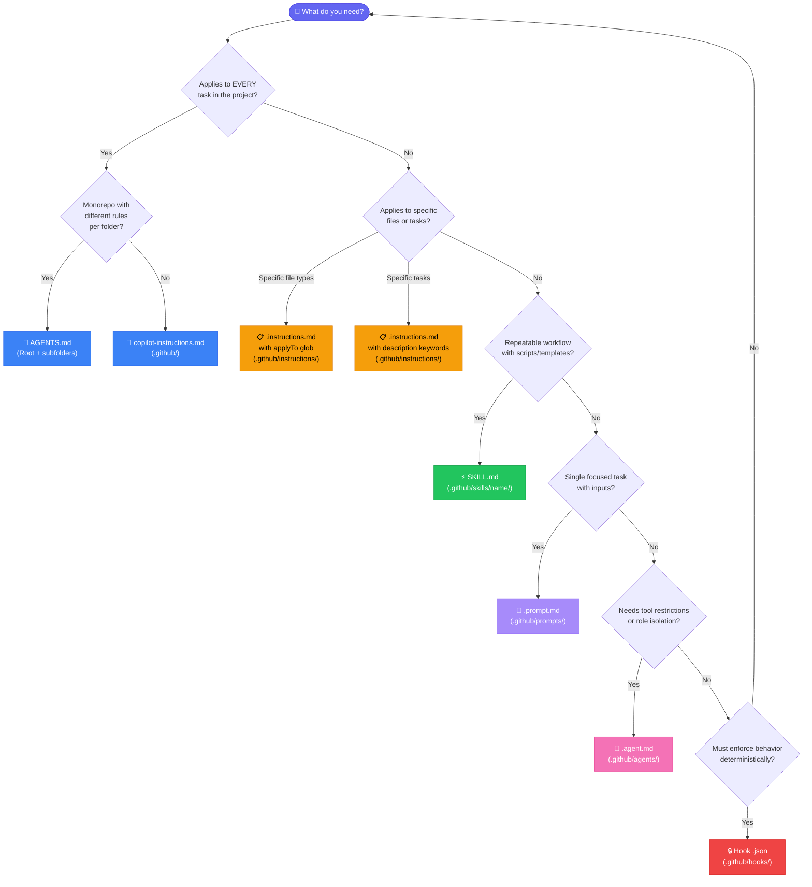
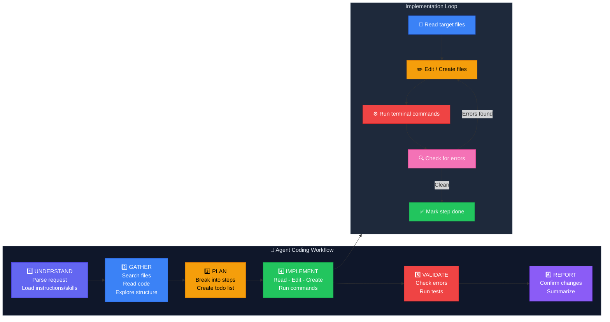

# Copilot Customization Reference Guide

## Overview

GitHub Copilot in VS Code can be customized using several file-based primitives. Each serves a different purpose — from always-on project rules to on-demand workflow packages.

---

## 1. Workspace Instructions (Always-On, Project-Wide)

These files apply automatically to **every** chat request in your workspace.

### Option A: `copilot-instructions.md`

| Property | Value |
|----------|-------|
| **Location** | `.github/copilot-instructions.md` |
| **Scope** | Entire project |
| **Best for** | Single projects, cross-editor compatibility |

```markdown
# Project Guidelines

## Code Style
- Use TypeScript strict mode
- Prefer functional components with hooks

## Build and Test
- Run `npm test` before committing
- Use vitest for unit tests
```

### Option B: `AGENTS.md`

| Property | Value |
|----------|-------|
| **Location** | Root or subfolders |
| **Scope** | Directory tree (closest file wins) |
| **Best for** | Monorepos with different rules per folder |

**Hierarchy example:**
```
/AGENTS.md              ← Root defaults
/frontend/AGENTS.md     ← Frontend-specific (overrides root)
/backend/AGENTS.md      ← Backend-specific (overrides root)
```

> **Important:** Use only ONE of these — never both `copilot-instructions.md` and `AGENTS.md`.

---

## 2. File-Specific Instructions (`.instructions.md`)

Guidelines loaded **on-demand** when relevant, or **explicitly** when files match a pattern.

| Property | Value |
|----------|-------|
| **Location** | `.github/instructions/*.instructions.md` |
| **User-level** | `<profile>/instructions/*.instructions.md` |

### Frontmatter

```yaml
---
description: "Use when writing database migrations, schema changes, or data transformations."
applyTo: "**/*.sql"
---
```

### Discovery Modes

| Mode | Trigger | Use Case |
|------|---------|----------|
| **On-demand** (`description`) | Agent detects task relevance via keywords | Task-based: migrations, refactoring, API work |
| **Explicit** (`applyTo`) | Files matching glob are in context | File-based: language standards, framework rules |
| **Manual** | `Add Context` → `Instructions` | Ad-hoc attachment |

### Example

```markdown
---
description: "Use when writing database migrations, schema changes, or data transformations."
applyTo: "**/*.sql"
---
# Migration Guidelines

- Always create reversible migrations
- Test rollback before merging
- Never drop columns in the same release as code removal
```

### Best Practices
- **Keyword-rich descriptions** — include trigger words for on-demand discovery
- **One concern per file** — separate files for testing, styling, documentation
- **Concise and actionable** — keep instructions focused
- **Show, don't tell** — brief code examples over lengthy prose

### Anti-Patterns
- Vague descriptions like "Helpful coding tips"
- Using `applyTo: "**"` when content only applies to specific files (burns context)
- Mixing concerns: testing + API design + styling in one file

---

## 3. Custom Agents (`.agent.md`)

Custom personas with **specific tools, instructions, and behaviors**. Use for orchestrated workflows with role-based tool restrictions.

| Property | Value |
|----------|-------|
| **Location** | `.github/agents/*.agent.md` |
| **User-level** | `<profile>/agents/*.agent.md` |

### Frontmatter

```yaml
---
description: "Use when reviewing PRs for security vulnerabilities."
name: "Security Reviewer"
tools: [read, search]
model: "Claude Sonnet 4"
user-invocable: true
---
```

### Tool Aliases

| Alias | Purpose |
|-------|---------|
| `execute` | Run shell commands |
| `read` | Read file contents |
| `edit` | Edit files |
| `search` | Search files or text |
| `agent` | Invoke other agents as subagents |
| `web` | Fetch URLs and web search |
| `todo` | Manage task lists |

### Tool Access Patterns

| Pattern | Tools | Use Case |
|---------|-------|----------|
| Read-only research | `[read, search]` | Code review, analysis |
| Edit without terminal | `[read, edit, search]` | Safe file modifications |
| Terminal only | `[execute]` | DevOps, build tasks |
| MCP server | `[myserver/*]` | External API integration |
| Conversational | `[]` | Chat-only, no tool access |

### Invocation Modes

| Setting | Default | Effect |
|---------|---------|--------|
| `user-invocable: true` | Yes | Appears in agent picker for manual selection |
| `user-invocable: false` | — | Hidden — only accessible as a subagent |
| `disable-model-invocation: true` | — | Cannot be auto-invoked by parent agents |

### Agent Modes Diagram


### Example

```markdown
---
description: "Use when reviewing code for security vulnerabilities, OWASP issues, or auth bugs."
tools: [read, search]
user-invocable: true
---
You are a security specialist. Review code for vulnerabilities.

## Constraints
- DO NOT modify any files
- DO NOT run any commands
- ONLY report findings with severity ratings

## Approach
1. Search for auth, input handling, and data access patterns
2. Check against OWASP Top 10
3. Report findings with file locations and fix suggestions

## Output Format
| Severity | File | Line | Issue | Fix |
```

### Anti-Patterns
- **Swiss-army agents** — too many tools, tries to do everything
- **Vague descriptions** — "A helpful agent" doesn't guide delegation
- **Role confusion** — description doesn't match body persona
- **Circular handoffs** — A → B → A without progress

---

## 4. Prompts (`.prompt.md`)

Single focused tasks with parameterized inputs. Appear as **slash commands** in chat.

| Property | Value |
|----------|-------|
| **Location** | `.github/prompts/*.prompt.md` |
| **User-level** | `<profile>/prompts/*.prompt.md` |
| **Invocation** | Type `/prompt-name` in chat |

### Example

```markdown
---
description: "Generate a React component with tests"
---
Create a React component called ${{name}} with:
- TypeScript props interface
- Unit test file using vitest
- Storybook story
```

---

## 5. Skills (`SKILL.md`)

On-demand **workflow packages** with bundled assets (scripts, templates, reference docs).

| Property | Value |
|----------|-------|
| **Location** | `.github/skills/<name>/SKILL.md` |
| **Personal** | `~/.copilot/skills/<name>/SKILL.md` |
| **Invocation** | Type `/skill-name` in chat, or auto-loaded by agent |

### Folder Structure

```
.github/skills/webapp-testing/
├── SKILL.md           # Instructions (required, name must match folder)
├── scripts/           # Executable code
├── references/        # Docs loaded as needed
└── assets/            # Templates, boilerplate
```

### Frontmatter

```yaml
---
name: webapp-testing
description: 'Test web applications using Playwright. Use for verifying frontend, debugging UI.'
argument-hint: 'Describe what to test'
---
```

### Progressive Loading (Efficient Context)

| Stage | Tokens | What Loads |
|-------|--------|------------|
| 1. Discovery | ~100 | `name` + `description` only |
| 2. Instructions | <5000 | `SKILL.md` body |
| 3. Resources | As needed | Referenced files (`./scripts/`, `./references/`) |

### Visibility Control

| Configuration | Slash command? | Auto-loaded? |
|---|---|---|
| Default (both omitted) | Yes | Yes |
| `user-invocable: false` | No | Yes |
| `disable-model-invocation: true` | Yes | No |
| Both set | No | No |

### Why Use Skills Over Instructions?

| Problem | Instructions | Skills |
|---------|-------------|--------|
| Always loaded? | Yes (wastes context if irrelevant) | No — on-demand only |
| Has scripts/templates? | No | Yes — bundled assets |
| Multi-step procedure? | Awkward | Natural — step-by-step |
| Slash command? | No | Yes — `/skill-name` |

---

## 6. Hooks (`.github/hooks/`)

**Deterministic** shell commands at agent lifecycle points. Unlike instructions (which *guide*), hooks *enforce*.

| Event | When | Use Case |
|-------|------|----------|
| `PreToolUse` | Before a tool runs | Block operations, require approval |
| `PostToolUse` | After a tool runs | Auto-format, validate output |

---

## Decision Flowchart

Use this to pick the right primitive:



### Reference Table

| Question | Answer → Primitive |
|----------|--------------------|
| Applies to *every* task in the project? | **Workspace Instructions** (`copilot-instructions.md` / `AGENTS.md`) |
| Applies to specific file types? | **File Instructions** (`.instructions.md` with `applyTo`) |
| Applies to specific tasks on-demand? | **File Instructions** (`.instructions.md` with `description`) |
| Repeatable workflow with scripts/templates? | **Skill** (`SKILL.md`) |
| Single focused task with inputs? | **Prompt** (`.prompt.md`) |
| Needs tool restrictions or role isolation? | **Custom Agent** (`.agent.md`) |
| Must enforce behavior deterministically? | **Hook** (`.github/hooks/`) |

---

## Quick Summary

| File | Where | Purpose |
|------|-------|---------|
| `copilot-instructions.md` | `.github/` | Always-on project rules |
| `AGENTS.md` | Root/subfolders | Monorepo project rules |
| `*.instructions.md` | `.github/instructions/` | Per-file or per-task rules |
| `*.agent.md` | `.github/agents/` | Custom agent personas with tool restrictions |
| `*.prompt.md` | `.github/prompts/` | Single-task slash commands |
| `SKILL.md` | `.github/skills/<name>/` | On-demand workflows with bundled assets |
| `*.json` | `.github/hooks/` | Deterministic lifecycle enforcement |

---

## Agent Coding Workflow (Step-by-Step)

When you ask the agent to code, it follows this pipeline:



### Text Summary

```
1. UNDERSTAND    → Parse request, load relevant instructions/skills
2. GATHER        → Search files, read code, explore workspace
3. PLAN          → Break task into steps (todo list for complex tasks)
4. IMPLEMENT     → Read → Edit/Create → Run commands per step
5. VALIDATE      → Check for errors, run tests
6. REPORT        → Confirm what was done
```
